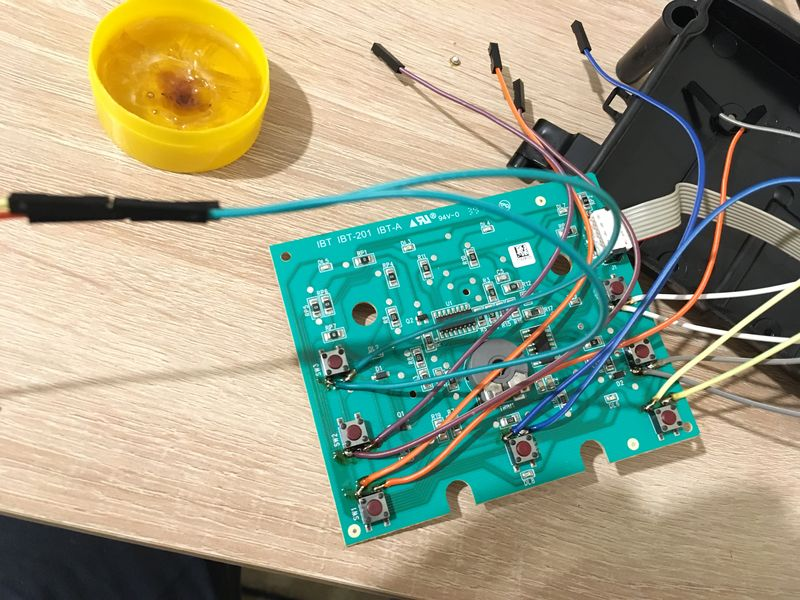
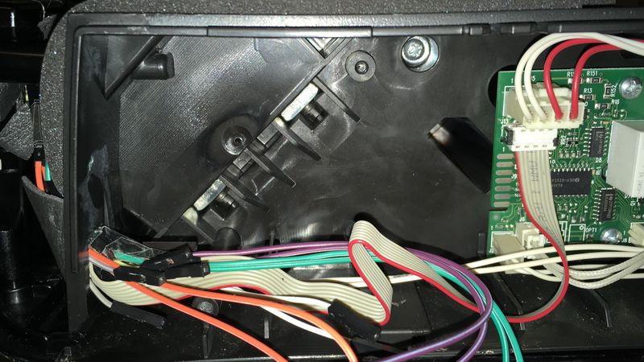

# RPiCoffee

This project's goal is to enable a coffee machine being able to respond to different HTTP-Responses. 

'Cause nobody likes to wait for the machine.

**Possible scenarios are:**
- turn on and shutting down the machine via HTTP-request
- brewing single and double espresso via HTTP-request
- brewing single and double coffee via HTTP-request
- starting the rinse program via HTTP-request (good for preheating the system)
- reading out machine status (e.g. water level, coffee bean depot, temperature, errors, ...)
- rendering a responsive web-app for better user experience
- data logging and visualisation in the web-app

The easiest way is to hack the existing frontpanel with overriding its simple pushbuttons. The HTTP-stuff can be handled by a microcontroller with a wifi-shield or a microcomputer like the the RaspberryPi Zero W which has wifi built in.

I will stick to the Raspberry because it is cheap (around 12 Eur for the Zero W) and I do not have to make any hardware modifications to get it up and running. The Raspberry will be prepared with a minimal setup based on Raspbian Lite described in this article: [https://www.heise.de/ct/ausgabe/2017-22-Digitales-Flugblatt-Raspberry-Pi-mit-Batterie-als-anonymer-WLAN-Hotspot-und-Webserver-3851689.html](https://www.heise.de/ct/ausgabe/2017-22-Digitales-Flugblatt-Raspberry-Pi-mit-Batterie-als-anonymer-WLAN-Hotspot-und-Webserver-3851689.html)

It will be powered by its own USB-power supply because I do not know how stable the coffee machines DC rails are and do not have the equipment for measurements. If everything works fine I will parallel the 230V rails of the coffee machine and the Raspberry's power supply.

## Progress

[x] Soldering jumper wires to all of the frontpanel buttons

[ ] Rework on the wire management

[ ] Solder the interface circuit

### Electromechanical stuff

The frontpanel looked very spacious at first, but there is a grid of plastic under the buttons giving minimal space for running the wires. This plastic construction is for transfering the mechanical force to the actual pushbuttons on the circuit and manages to transfer the light of the SMD-LEDs to the front. So if you really mess up, the buttons stop working, the LED's light will be blocked and the case of the frontpanel will not close anyway. You could cut the grid a little bit, but I wanted to modify the machine as little as possible.

First step is finished with soldering jumper cables to every switch. I planned to do the same with the LEDs for reading out the machine's status and errors but the SMD-LEDs are pretty small and my solder tip seemed to big for proper soldering. You can see them some of them (DL3 - DL5) in the first row of the circuit board.

I will have to rework the running of the wires a little bit because right now the button press feels softer than before. Meaning, the wires are pressed down by the plastic grid, eventually causing damage to the isolation in the future.

There is a hole for the original flat wire which is big enough for my hacked wires.

Here is the place where the Raspberry Pi and the interface circuit is planned to stay at. This looks like a safe place for electronics (you have to be aware of humidity) because the mainboard of the machine is placed there, too.

Testing of the hacked frontpanel:

