# RPiCoffee

This project's goal is to make a coffee machine responsive to different HTTP-Requests, like:

**JSON-Request**
```json
{
  "userID": "admin",
  "actions": [
    "turn on",
    "brew espresso"
  ]
}

```
'Cause nobody likes to wait for the machine.


**Possible scenarios are:**
- turn on and shutting down the machine via HTTP-request
- brewing single and double espresso via HTTP-request
- brewing single and double coffee via HTTP-request
- starting the rinse program via HTTP-request (good for preheating the system)
- chaining simple actions like in the example above
- reading out machine status (e.g. water level, coffee bean depot, temperature, errors, ...)
- rendering a responsive web-app for better user experience
- data logging and visualisation in the web-app


### Intro ###
The easiest way is to hack the existing frontpanel via overriding its pushbuttons. The HTTP-stuff can be handled by a microcontroller with a wifi-shield or a microcomputer like the the RaspberryPi Zero W which has built-in wifi.

I will stick to the Raspberry because it is cheap (around 12 Eur for the Zero W) and I do not have to make any hardware modifications to get it up and running. The Raspberry will be prepared with a minimal setup based on Raspbian Lite with everything unnecessary turned off. 

It's described in this article: [https://www.heise.de/ct/ausgabe/2017-22-Digitales-Flugblatt-Raspberry-Pi-mit-Batterie-als-anonymer-WLAN-Hotspot-und-Webserver-3851689.html](https://www.heise.de/ct/ausgabe/2017-22-Digitales-Flugblatt-Raspberry-Pi-mit-Batterie-als-anonymer-WLAN-Hotspot-und-Webserver-3851689.html)

The RPi will be powered by its own USB-power supply because I do not know how stable the coffee machines DC rails. Maybe later I will parallel the 230V rails of the coffee machine to the Raspberry's AC power supply.

On the RPi there will be running Flask for the HTTP-stuff and maybe a mongodb database for some data collecting.


### Mobile / Responsive User Interface stuff

#### WebApp-UI talking to the hardware
I combined my html+skeleton prototype with some Flask and the LED() function of the Python module gpiozero. In the animation below you can see one of the first iterations. All the buttons of the machine's front are accessible programatically right now. The "steam button" is not implemented in the WebApp because in general it is never used.

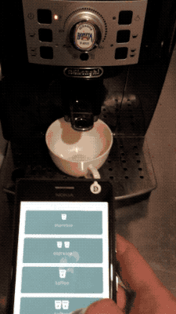

The feature menus (statistics, settings and mining) are not implemented right now. I implemented a small java script popup to inform the user about that when one of these buttons is clicked.

I already installed mongoDB on the raspberry to save statistics and settings and made some first experiments.


**A little bit about the UI talking to the machine**

In fact, there is no JSON parsing going on in the actual implementation (in contrast to the idea the example in the beginning may imply). I created two dictionaries with (I hope) self explaining keys, one for the action and one for a status message. The dictionary helps to abstract the GPIO pins to their actual functions (like brewing espresso) and make the code more readable.

The value of each item is the related to a GPIO Pin. The RPi Zero's GPIO Pins are accessible via the LED()-function of the Python-module gpiozero. Each pin can be enabled and disabled via the LED(x).on() and LED(x).off().

My dictionaries look like this:

```
	# Turn machine on/off: blue wires
	outputs["onOff"] = LED(26)
	message["onOff"] = "Maschine faehrt hoch oder runter!"

	# Single espresso: white wires
	outputs["espressoX1"] = LED(19)
	message["espressoX1"] = "Einfacher Espresso im Bau!"
```

In concluson, transferring an HTML-button press via Flask to a button on the coffee-machine is as simple as:

```
@app.route("/", methods=['POST'])
def controlMachine():

	# possible actions = dictionary-keys

	action = request.form['action']
	print("Action: {}".format(action))

	# press button
	outputs[str(action)].on()

	# hold button for 200ms
	sleep(0.2)

	# release button
	outputs[str(action)].off()

	return str(message[str(action)])
```


#### Two additional API Calls (weather and train departure)

I stopped the crypto-mining and implemented two other APIs instead. It is still possible to check the miners status via the URL /?infos=show&mining=show but I reused its button for checking train departure times.

I use the hafas-API, which is free but you need to write an email to them to get a demo-key. If you still want to use it afterwards, you have to sign some kind of agreement.

You can get infos to their API here: [http://demo.hafas.de/openapi/vbb-proxy/](http://demo.hafas.de/openapi/vbb-proxy/)

Before that I used a public API without authentication, that was very slow (more than 3 seconds for retrieving departure information). The hafas-API ist much faster. Postman measures ~440ms response delay for a request on their service "departureBoard".

The second API I integrated is the [https://www.metaweather.com/](https://www.metaweather.com/). This one is one of the nicest APIs I have seen so far. It is structured very good (no deep trees of JSON) and the creators even give access to some nice weather icons you may use. The icon's filenames are exactly like the corresponding JSON values, e.g. "lc" and "lc.svg" for "Light Cloud"! How cool is that? No need to search for icons or parse anything :-)

And: No need to sign up for anything! For example, here is the ressource (for Berlin) I use: [https://www.metaweather.com/api/location/638242/](https://www.metaweather.com/api/location/638242/) :-)

I gave it a very subtle look, to not distract too much from the WebApps main purpose ;)
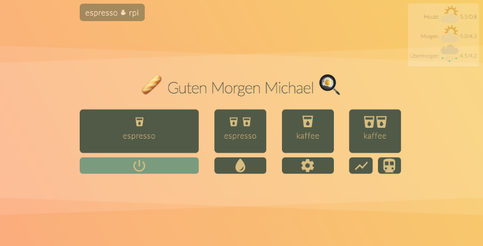

I do extract only the trains with the direction I need and limit the initially shown departure times to five trains. With the button "Mehr Verbindungen" (= show more connections), every departure time I extracted is shown. The API shows only trains with max. one hour depature time in future resulting in ~19 rows after clicking that button.


#### Second iteration: WebApp-UI
I made a redesign of the UI because I did not like the dark theme (see below). I began prototyping the complete thing in Sketch and transfered it later to HTML and CSS with the help of Skeleton ([getskeleton.com](http://www.getskeleton.com)) and Sketch's CSS and SVG output-features. 

I picked a nice morning like gradient from [webgradients.com](http://webgradients.com) and played around with colorsets from [coolors.co]. For the final touch I added these transparent triangle things for some foggy morning effects. They are technically stacked CSS3 clipping paths of div-elements I colored with #fff and alpha = 0.2 ;-)

The icons are this time from Google's material design icon-font ([https://material.io/icons/](https://material.io/icons/)) I found them via the awesome iconfont plugin for Sketch by Kerem Sevencan ([https://github.com/keremciu](https://github.com/keremciu))

All the hover interaction-stuff and responsiveness is finished. Everything else (settings, stats and cryptomining😅) will be added iteratively as soon as main functionalities are up and running.


Everything was uploaded to my github-repo at the UI path.


#### My coffee machine is able to mine crypto currencies (in a very unprofitable way) +++ UPDATE: Mining still possible but stopped right now +++
The mining "menu" is implemented. I installed a miner on the RPi to mine "MagiCoins" (XMG) for the suprnova-Pool. I installed everything like shown here: [http://techgeeks.de/bitcoin-mining-mit-dem-raspberry-pi-3/](http://techgeeks.de/bitcoin-mining-mit-dem-raspberry-pi-3/)

I wrote a little bash-script to start the miner with all the needed login credentials to connect to the mining pool. The bash script is started via the nohup command to prevent it from shutting down when the ssh-connection to the RPi is closed.

The nice thing about nohup is its automatic terminal-to-file output. So, getting the miner's current status can be simply done by reading the last line of that file.

If the mining-button is clicked, there are made some API calls to my suprnova-account, coinmarketcap.com (for the exchange rate) and the miners nohup output is read. Everything is shown in some kind of output display.

I do not know very much about crypto currencies and I am not really interested in them. But I thought it is a funny thing to let the coffee machine do some mining in the background. I did not optimize aything on the RPi and it is totally not profitable right now. In the screenshot it is running for ~1,5 days. Do the math with the given rate for electricity :-)

Fun fact: In the link above the mining was profitable on a Raspberry Pi 3 (based on January 2018). 
In my case do use a much slower RPi Zero with just one CPU core. Maybe one reason for not coming close to the results shown in the article. Also the difficulty should be much higher right now ;-)

Therefore it is reasonable to stop it in near future :-) Maybe one XMG is a nice goal.

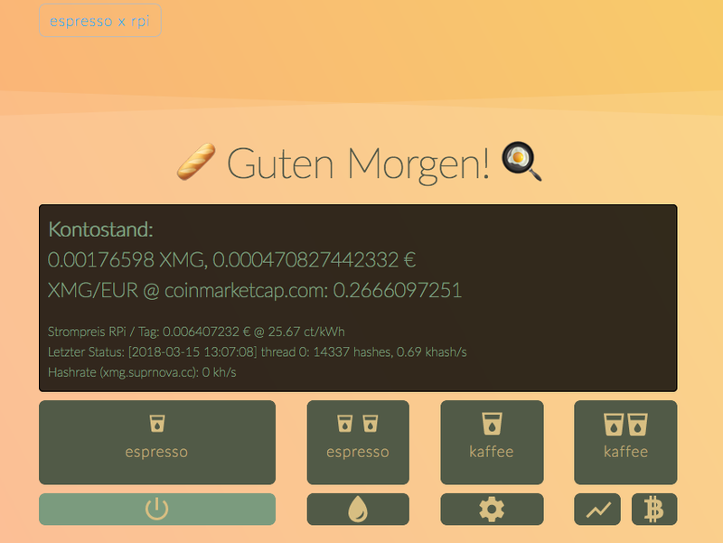


### Electromechanical stuff

One of the big next goals is to get feedback of the hardware. It would be very helpful to see if the machine is running or shut down. You could check and hear it from distance by pressing the clean button and press it again to stop the machine from pumping water. Obviously that is not very convenient.

Also if the water level is too low or the coffee grounds box is full, the machine would not react to any input but turning off. But like in the first example, the user is not informed by that.

One way to get feedback is to grab the LEDs' signals and convert them to the 3,3V level of the RPi. I already soldered enamelled copper wires to some testpoints of the front-panel PCB and made some experiments. Unfortunately the signals are not as easy to distinguish as expected. My last try was to read the voltage drops via the A/D converter of an attiny. That looked promising at first but did not work as reliable as needed. I think it has something to do with the LEDs' PWM control. Therefore the signal has to be filtered somehow. That could be done inside the attiny or the RPi.

Another approach (that might be easier and probably does not need any filtering) is to directly grab the sensors signals, like the water-level sensor below the watercontainer.

Everything is fitting quite nice into the spacious area next to the original electronics. I reused the original cable managment to run the power cord for the USB power-supply powering the Raspberry Pi.

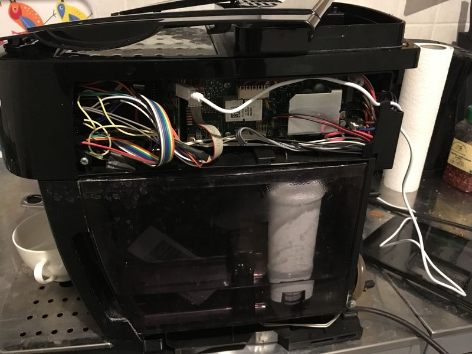


My interface circuit is connected via these colorful 2,54mm grid jumper wires to the Raspberry Pi. I ordered a lot of them on ebay/china some time ago. They are available with male and female connectors in different lengths, pricing around 1-2€ for a package of 40. I also used them to connect the coffee-machine's buttons to the interface circuit. Therefore I cutted them and soldered enamelled copper wire to them (see below).
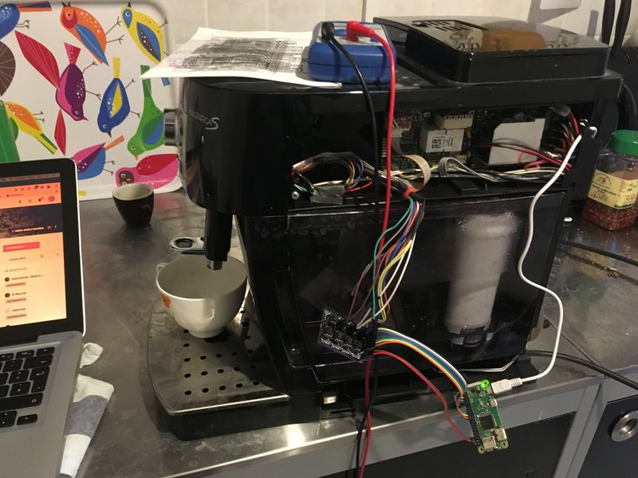
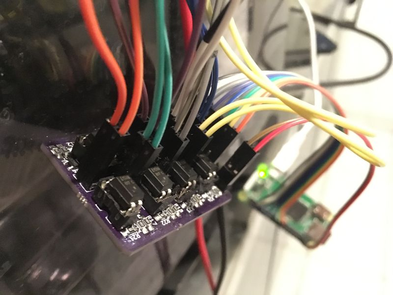

All the parts soldered to the PCB. Unfortunately, I did not route one of the ground lines. That is why there is a small pice of enamelled copper wire running at the lower edge of the PCB.
I did not solder any smd stuff before this project. But it worked pretty good with the help of flux! I applied a mixture of colophonium and ethanol to the PCB and used my standard soldering tip with 1mm solder and somethin around 330°C.
I put some sockets to the PCB for the optocouplers because I did not want to heat-stress the stuff inside of them too much.


Front and back view of the PCBs. I really like the printing quality!

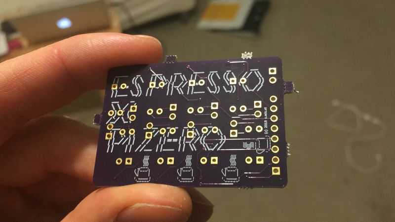

The components labels placing is not really helpful and sometimes not readable but my focus was to save as much space as possible. Anyway, not a big deal. I will solder it with my PCB software openend ;-)

The PCBs are delivered!


Ordered: 18th February

Shipped: 27th February

Recieved (Germany): something around 6th March


Finally I designed the PCB of the interface circuit. Luckily oshpark has a good documentation for accepted PCB-files from different softwares, so I picked one of these softwares. After some youtube-videos I was able to design my PCB in KiCad.
Despite of rearranging everything nicely there aren't any big changes to the prototyped circuit. In my final iteration of the PCB, I changed the resistors and transistors to SMD parts. Otherwise the cost for my order would have been doubled. Now it is 12$ for three PCBs

 


I don't know if I am able to solder SMD parts with my big solder tip, maybe I will order some smaller ones.

Also I got some meters of enamelled copper wire to replace the quite thick wires I soldered to the interface before.

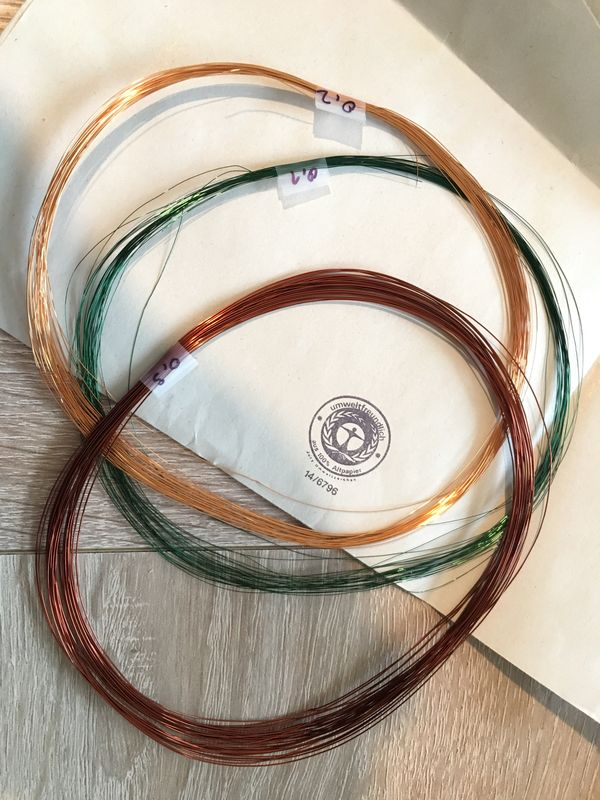

I used the 0.3mm one. Now there is nothing interfering with the buttons anymore and the diameter is smaller than the SMD parts on the circuit. Everything fine!

The soldering looks a little bit messy because I like to use a lot of flux.
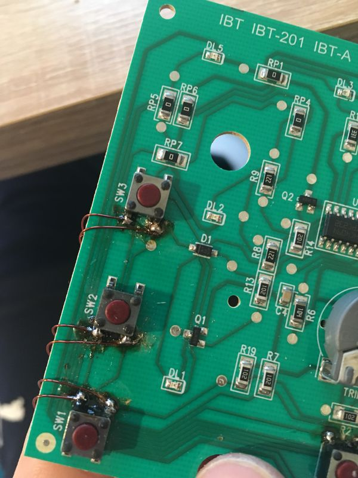

Now it looks much cleaner than before. I taped the wires to the original flat cable to enhance the sturdiness of the cable harness.


That is the actual side-view right now. I won some space because of the better cable management, but in general it looks like before.


First espresso via webbrowser! Sorry for the jumpy filming, was a little bit excited :-D

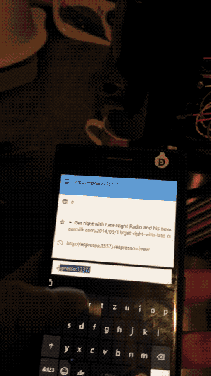

Setting GPIO Pins via webbrowser with Flask. The Raspberry Pi and the laptop are connected to my local wlan:


Yesterday I got my order of optocouplers, transistors and other stuff. I made a litte circuit to drive two channels / switches via GPIO Pins. So it can control two buttons. For my tests I connected them to the power button and the espresso button. The final layout will be produced by some PCB manufacturer.


First test of the hacked frontpanel via "hotwiring" the buttons:


Here is the place where the Raspberry Pi and the interface circuit is planned to stay at. This looks like a safe place for electronics (you have to be aware of humidity) because the mainboard of the machine is placed there, too.


There is a hole for the original flat wire which is big enough for my hacked wires.


I will have to rework the running of the wires a little bit because right now the button press feels softer than before. Meaning, the wires are pressed down by the plastic grid, eventually causing damage to the isolation in the future.


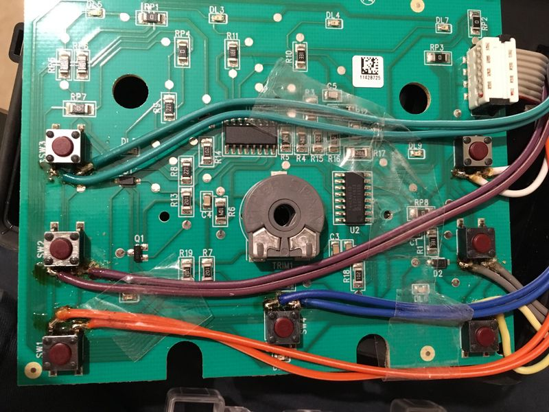

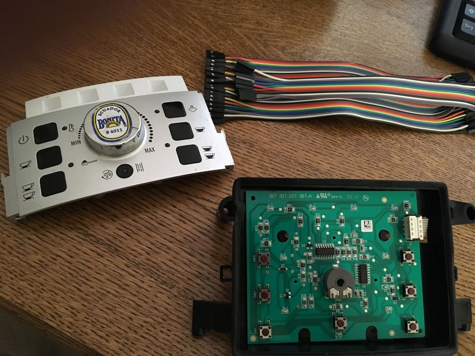

First step is finished with soldering jumper cables to every switch. I planned to do the same with the LEDs for reading out the machine's status and errors but the SMD-LEDs are pretty small and my solder tip seemed to big for proper soldering. You can see them some of them (DL3 - DL5) in the first row of the circuit board.

The frontpanel looked very spacious at first, but there is a grid of plastic under the buttons giving minimal space for running the wires. This plastic construction is for transfering the mechanical force to the actual pushbuttons on the circuit and manages to transfer the light of the SMD-LEDs to the front. So if you really mess up, the buttons stop working, the LED's light will be blocked and the case of the frontpanel will not close anyway. You could cut the grid a little bit, but I wanted to modify the machine as little as possible.
