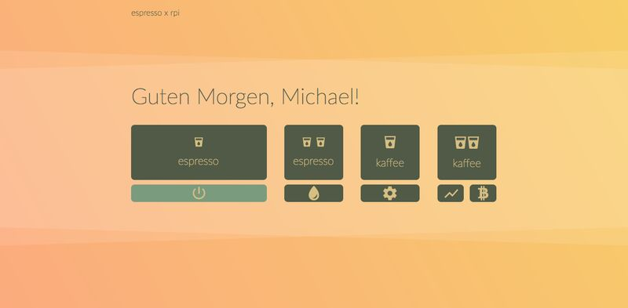
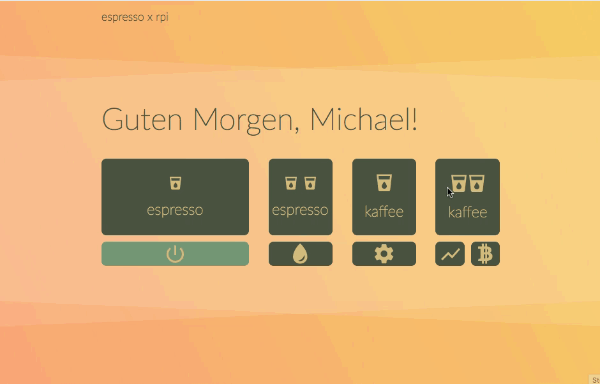

# RPiCoffee

This project's goal is to make a coffee machine responsive to different HTTP-Requests, like:

**JSON-Request**
```json
{
  "userID": "admin",
  "actions": [
    "turn on",
    "brew espresso"
  ]
}

```
'Cause nobody likes to wait for the machine.

_in fact: There are no JSONs involved right now :-D (see section "A little bit about [...]") Maybe in near future I will design a RESTful API supporting some cool JSON-responses like the one above_

see the project's wiki for more detailled information: [https://github.com/misteu/RPiCoffee/wiki](https://github.com/misteu/RPiCoffee/wiki)

**Possible scenarios are:**
- turn on and shutting down the machine via HTTP-request
- brewing single and double espresso via HTTP-request
- brewing single and double coffee via HTTP-request
- starting the rinse program via HTTP-request (good for preheating the system)
- chaining simple actions like in the example above
- reading out machine status (e.g. water level, coffee bean depot, temperature, errors, ...)
- rendering a responsive web-app for better user experience
- data logging and visualisation in the web-app


### Intro ###
The easiest way is to hack the existing frontpanel via overriding its pushbuttons. The HTTP-stuff can be handled by a microcontroller with a wifi-shield or a microcomputer like the the RaspberryPi Zero W which has built-in wifi.

I will stick to the Raspberry because it is cheap (around 12 Eur for the Zero W) and I do not have to make any hardware modifications to get it up and running. The Raspberry will be prepared with a minimal setup based on Raspbian Lite with everything unnecessary turned off. 

It's described in this article: [https://www.heise.de/ct/ausgabe/2017-22-Digitales-Flugblatt-Raspberry-Pi-mit-Batterie-als-anonymer-WLAN-Hotspot-und-Webserver-3851689.html](https://www.heise.de/ct/ausgabe/2017-22-Digitales-Flugblatt-Raspberry-Pi-mit-Batterie-als-anonymer-WLAN-Hotspot-und-Webserver-3851689.html)

The RPi will be powered by its own USB-power supply because I do not know how stable the coffee machines DC rails. Maybe later I will parallel the 230V rails of the coffee machine to the Raspberry's AC power supply.

On the RPi there will be running Flask for the HTTP-stuff and maybe a mongodb database for some data collecting.


### Mobile / Responsive User Interface stuff

#### WebApp-UI talking to the hardware
I combined my html+skeleton prototype with some Flask and the LED() function of the Python module gpiozero. In the animation below you can see one of the first iterations. All the buttons of the machine's front are accessible programatically right now. The "steam button" is not implemented in the WebApp because in general it is never used.


The feature menus (statistics, settings and mining) are not implemented right now. I implemented a small java script popup to inform the user about that when one of these buttons is clicked.

I already installed mongoDB on the raspberry to save statistics and settings and made some first experiments.

+++ update +++

Instead of the fun but pretty useless mining, there is now implemented an info screen with train departure times. See section "API-Calls [...]" in my wiki.

#### Second iteration: WebApp-UI
I made a redesign of the UI because I did not like the dark theme (see below). I began prototyping the complete thing in Sketch and transfered it later to HTML and CSS with the help of Skeleton ([getskeleton.com](http://www.getskeleton.com)) and Sketch's CSS and SVG output-features. 

I picked a nice morning like gradient from [webgradients.com](http://webgradients.com) and played around with colorsets from [coolors.co]. For the final touch I added these transparent triangle things for some foggy morning effects. They are technically stacked CSS3 clipping paths of div-elements I colored with #fff and alpha = 0.2 ;-)

The icons are this time from Google's material design icon-font ([https://material.io/icons/](https://material.io/icons/)) I found them via the awesome iconfont plugin for Sketch by Kerem Sevencan ([https://github.com/keremciu](https://github.com/keremciu))

All the hover interaction-stuff and responsiveness is finished. Everything else (settings, stats and cryptomining😅) will be added iteratively as soon as main functionalities are up and running.





Everything was uploaded to my github-repo at the UI path.
